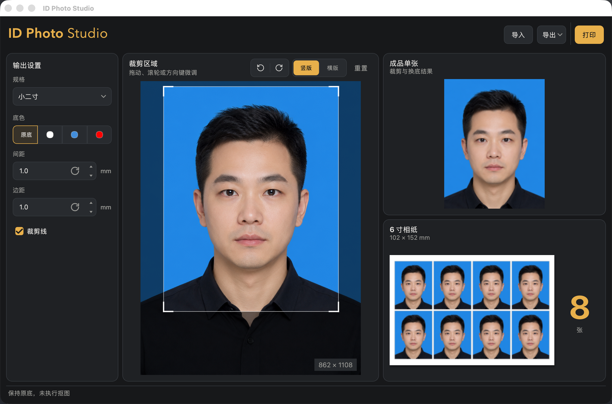

<div align="center">


# ID Photo Studio

**离线证件照制作工具。自动抠图换底，按标准规格裁剪排版，直接打印或导出。**

[](https://github.com/adrian-x1/IDPhotoStudio/actions/workflows/ci.yml)
[](https://github.com/adrian-x1/IDPhotoStudio/releases/latest)
[](LICENSE)
[](https://github.com/adrian-x1/IDPhotoStudio/releases/latest)
[](https://www.python.org/downloads/)

[下载安装](#下载安装) · [功能](#功能) · [使用流程](#使用流程) · [打印说明](#打印说明) · [参与开发](docs/DEVELOPMENT.md)

</div>



导入照片，自动识别人脸位置裁剪，换成白、蓝或红底，排满一张 6 寸相纸，然后打印或导出。

全部处理都在本机完成，照片不会上传到任何服务器，运行时也不需要联网。

## 功能

- **自动裁剪** — 识别人脸位置，按规格算好头顶留白和脸部占比，不用手动对齐。没检测到人脸时退回手动裁剪，可以拖拽、滚轮或方向键微调。
- **换底色** — 白、蓝、红三种，也可以保持原底不动。
- **十种内置规格** — 一寸、二寸、三寸、大一寸、小一寸、大二寸、小二寸、简历照、普通话水平测试、英语四六级。
- **自定义尺寸** — 宽高各自独立输入，10–152mm。上限取 4R 相纸的长边，因为再大也排不进去。
- **6 寸相纸排版** — 自动求解一张纸能排多少张，间距和边距可调（0–20mm），可选裁剪参考线。
- **导出与打印** — 单张 JPEG / PNG，或整版相纸的 JPEG / PNG / PDF；也能直接调系统打印。

全部按 300 DPI 输出。

## 下载安装

到 [Releases](https://github.com/adrian-x1/IDPhotoStudio/releases/latest) 页面下载对应平台的安装包。

### macOS（Apple Silicon）

下载 `IDPhotoStudio-x.y.z-macOS-arm64.dmg`，双击打开后把 ID Photo Studio 拖进「应用程序」文件夹。

首次打开会提示「无法验证开发者」，因为安装包没有做 Apple 代码签名。绕过方法：在「应用程序」里**右键点击**它，选「打开」，再在弹窗里确认「打开」。之后就能正常双击启动了。

如果右键仍被拦，去「系统设置 → 隐私与安全性」，在底部找到被阻止的提示，点「仍要打开」。

仅支持 M 系列芯片的 Mac。Intel Mac 暂不支持，因为依赖的 mediapipe 1.0.0 没有发布 macOS x86_64 版本。

### Windows（x64）

下载 `IDPhotoStudio-x.y.z-Windows-x64-Setup.exe`，双击一路下一步。安装需要管理员权限。

SmartScreen 可能提示「未知发布者」，点「更多信息 → 仍要运行」即可。同样是没做代码签名的缘故。

## 使用流程

1. **导入** — 点右上角「导入」，或把照片直接拖进窗口。
2. **选规格和底色** — 左侧挑内置规格，或填自定义尺寸；底色选白、蓝、红会在后台抠图，选「原底」则不动原图背景。
3. **微调裁剪** — 中间的裁剪框可以拖动、滚轮缩放、方向键逐像素移动，也能整体旋转和切换横竖版。右下角实时显示裁剪后的像素尺寸。
4. **导出或打印** — 右上「导出」存单张或整版相纸，「打印」直接调系统打印对话框。右侧同时给出成品单张和 6 寸相纸的排版预览，以及一张纸能排几张。

## 打印说明

用 EPSON L805 这类照片打印机时，驱动里的纸张类型必须选**光泽照片纸**。选普通纸会出现竖条纹和偏色。

## 命令行

`idphoto_cli.py` 提供一条最小的批处理通路，直接产出排好版的 4R 相纸 PNG：

```bash
python idphoto_cli.py 照片.jpg 一寸 白 --output-dir out
```

只支持内置规格，不支持自定义尺寸和直接打印——那些走图形界面。

## 参与开发

从源码运行、跑测试、自己打包、发布新版本，都在 [docs/DEVELOPMENT.md](docs/DEVELOPMENT.md)。提交约定见 [CONTRIBUTING.md](CONTRIBUTING.md)，版本变更记录见 [CHANGELOG.md](CHANGELOG.md)。

## 技术栈

- **抠图** — ISNet（isnet-general-use），onnxruntime CPU 直接推理
- **人脸定位** — MediaPipe FaceLandmarker
- **界面** — PySide6

## 许可

[MIT](LICENSE)
